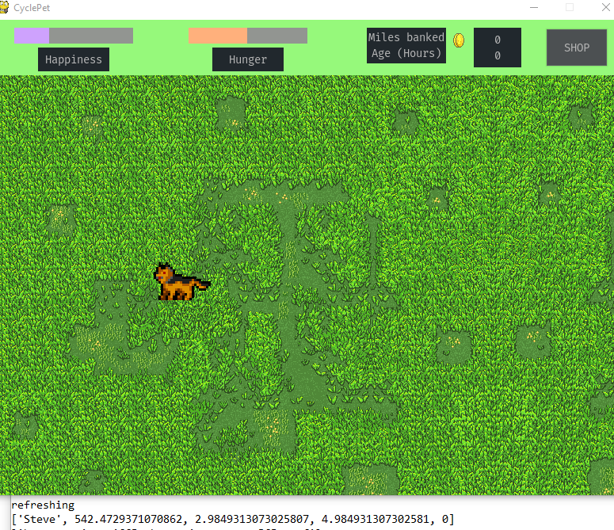

# CyclePet
Take care of a pet using coins earned by exercising, a work in progress 
<p align="center">
  
</p>

<b> [Cyclepet v0.1 Short Demo Video](http://www.youtube.com/watch?v=oo9m0uQtJtw) </b>
# Libraries used

- [pygame](https://www.pygame.org/) Game rendering and event tracking
- [pygame_gui](https://pygame-gui.readthedocs.io/en/latest/quick_start.html) Buttons and UI styling
- [requests](https://requests.readthedocs.io/en/master/) HTTP requests for strava API use

### Included with most python distributions
- [Pickle](https://docs.python.org/3/library/pickle.html) Save states
- [Webbrowser](https://docs.python.org/3/library/webbrowser.html) Link opening for API authorization 
- [Time](https://docs.python.org/3/library/time.html) Measure passing of time


# How to Run

Requires knowledge of your platforms command line 

1. Download github as .zip

2. Extract files into a new folder, navigate to directory using 

``` 
cd \path
```
3. Use pip to install packages

```
pip install -r requirements.txt

or 

pip3 install -r requirements.txt
```
4. Run program
```
python gui.py

or

python3 gui.py
```
## First time setup

1. Enter in 1 and press enter to create a new pet

2. A browser window will open with the strava authorization prompt, login to strava and authorize the application

3. After authorizing, copy the API key located in the localhost url. Paste into command prompt and hit enter
#### For example, if your URL looks like 
 
 http://localhost/exchange_token?state=&code=682e0c97br536070920d60bd8a254a778e760d7c&scope=read

#### You should paste in 

682e0c97br536070920d60bd8a254a778e760d7c

4. Follow along with prompts to complete the creation of your pet


# Releases
<b> Current Version : 0.1 </b>
  
 
### 0.1

  - Pet animations
  - Background upgrades
  - Play with your pet to increase happiness
  
  
### 0.0
  - API integration
  - Basic pet health mechanics
  - Save/Load current pet
  - Placeholder art
  
  
  
  
  
 # Todo
 - [o]  Support running
 - [o]  Sound / music
 - [ o ]  Food animations
 - [ ]  Settings screen
 - [ ]  Catch Connection problems
 - [ ]  Cast age into days or years
 - [ ]  Shop UI
 - [ ]  Different pet art
 - [ ]  requirements.txt pip install
 - [ ]  Remove pygame_UI to allow for pyinstaller distribution
 - [ ]  Name of pet in UI
 - [ ]  Clean up imports
 
 * = in progress
 o = in testing
 x = complete

 
<p align="center">
  
</p>

